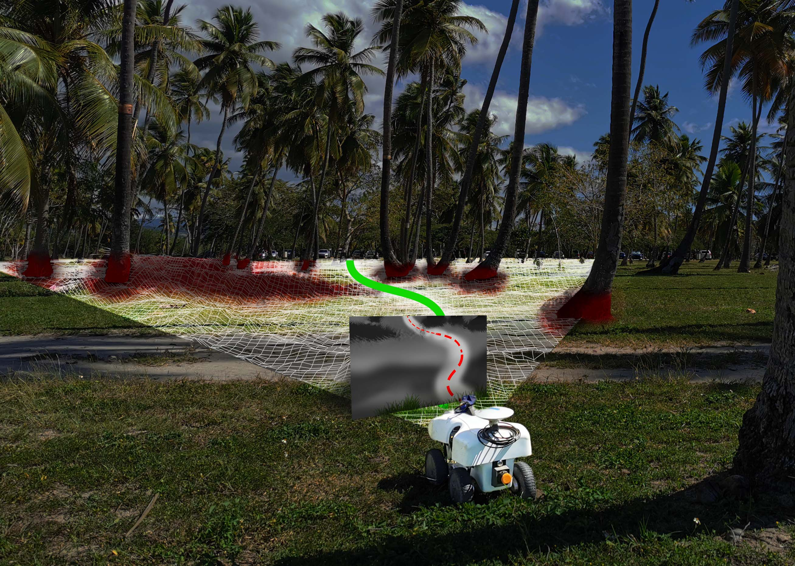

# WayFAST: Navigation with Predictive Traversability in the Field
Mateus V. Gasparino, Arun N. Sivakumar, Yixiao Liu, Andres E. B. Velasquez, Vitor A. H. Higuti, John Rogers, Huy Tran, and Girish Chowdhary

Paper website: https://mateusgasparino.com/wayfast-traversability-navigation/



## Download our dataset:
`curl -L  https://uofi.box.com/shared/static/wryubgcx24y0i3bt8n6cbkqpmtg8pe02 --output myfile.zip`

## Cite our paper:
```
@article{gasparino2022wayfast,
  title={WayFAST: Navigation with Predictive Traversability in the Field},
  author={Gasparino, Mateus Valverde and Sivakumar, Arun Narenthiran and Liu, Yixiao and Velasquez, Andres Eduardo Baquero and Higuti, Vitor Akihiro Hisano and Rogers, John and Tran, Huy and Chowdhary, Girish},
  journal={IEEE Robotics and Automation Letters},
  year={2022}}
```
