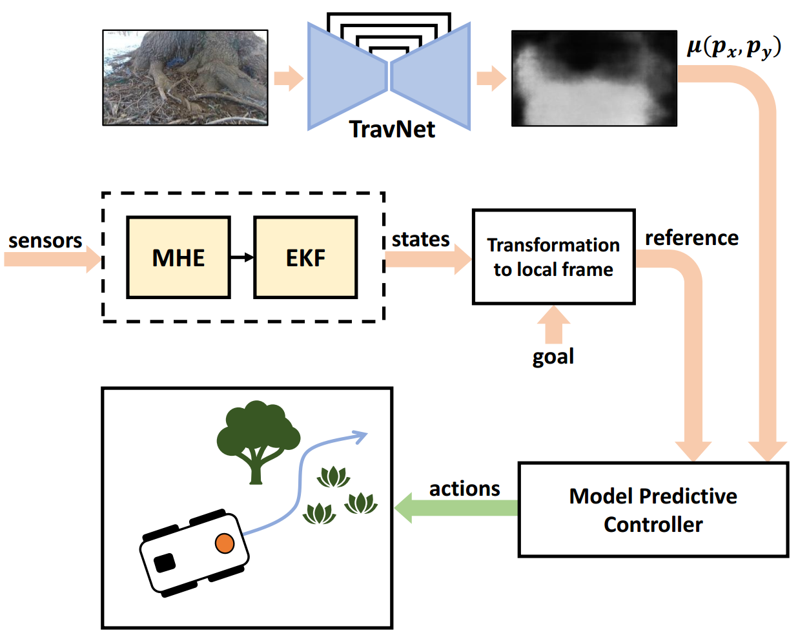

# WayFAST: Navigation with Predictive Traversability in the Field
[Mateus V. Gasparino](https://scholar.google.com/citations?user=UbtCA90AAAAJ&hl=en), Arun N. Sivakumar, Yixiao Liu, Andres E. B. Velasquez, Vitor A. H. Higuti, John Rogers, Huy Tran, and Girish Chowdhary

<p align="justify">
    We present a self-supervised approach for learning to predict traversable paths for wheeled mobile robots that require good traction to navigate. Our algorithm, termed WayFAST (Waypoint Free Autonomous Systems for Traversability), uses RGB and depth data, along with navigation experience, to autonomously generate traversable paths in outdoor unstructured environments. Our key inspiration is that traction can be estimated for rolling robots using kinodynamic models. Using traction estimates provided by an online receding horizon estimator, we are able to train a traversability prediction neural network in a self-supervised manner, without requiring heuristics utilized by previous methods. We demonstrate the effectiveness of WayFAST through extensive field testing in varying environments, ranging from sandy dry beaches to forest canopies and snow covered grass fields. Our results clearly demonstrate that WayFAST can learn to avoid geometric obstacles as well as untraversable terrain, such as snow, which would be difficult to avoid with sensors that provide only geometric data, such as LiDAR. Furthermore, we show that our training pipeline based on online traction estimates is more data-efficient than other heuristic-based methods.
</p>

Paper website: https://mateusgasparino.com/wayfast-traversability-navigation/


## Download our dataset:
`curl -L  https://uofi.box.com/shared/static/wryubgcx24y0i3bt8n6cbkqpmtg8pe02 --output myfile.zip`

## Cite our paper:
```
@article{gasparino2022wayfast,
  title={WayFAST: Navigation with Predictive Traversability in the Field},
  author={Gasparino, Mateus Valverde and Sivakumar, Arun Narenthiran and Liu, Yixiao and Velasquez, Andres Eduardo Baquero and Higuti, Vitor Akihiro Hisano and Rogers, John and Tran, Huy and Chowdhary, Girish},
  journal={IEEE Robotics and Automation Letters},
  year={2022}}
```

## System requirements
- Linux (Tested on Ubuntu 20.04)
- Python3 (Tested using Python 3.8) 
- PyTorch (Tested using Pytorch 1.13.1) 
- CUDA (Tested using CUDA 11.7)

## Our method



## Experimental results

